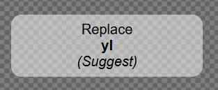
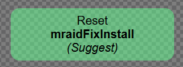

### SETUP 
- B1: `Phải có nodejs`, nếu chưa có thì download bản v22.13.1 (hoặc mới nhất cũng đc)
- B2: mở terminal (gitbash cũng dc), gõ lệnh `npm i` 
- B3: gõ lệnh `npm run dev` để check layout playable
- B4: Configs layout trong `src/services/ConfigData.ts`. 

### TAILWIND
## CDN
- vào đây check class của tailwind
- `https://cdn.jsdelivr.net/npm/@tailwindcss/browser@4`
### ------------------------------

### BUILD RA CÁC MẠNG
- B1: trước khi `build` check qua `folder plugin-ads`, vào file `fixmraid.js` xem link store đã đúng cho app hiện tại chưa.
- B2: Mở terminal hoặc gitbash - `ưu tiên`.
- B3: Chạy `npm run build` để build ra file index trong `folder dist` trước.
- B4: Chạy tiếp lệnh `node build-inline.cjs unity` để build ra file `index-unity` trong folder `build`.

## Khi `replace các mạng`
- click 1 lần vào ;
- click 2 lần vào ;
- sau đó export ra -> Done
### ------------------------------